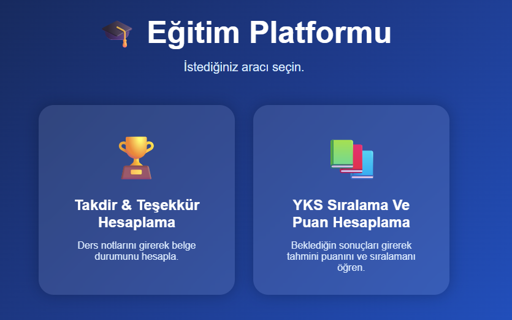
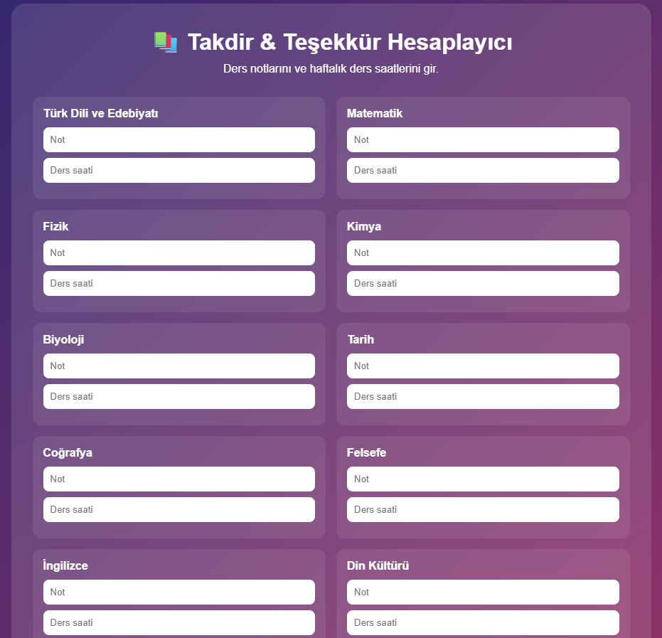
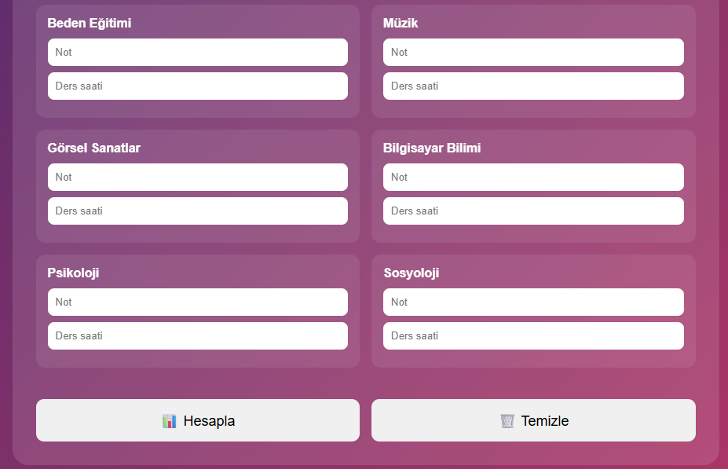
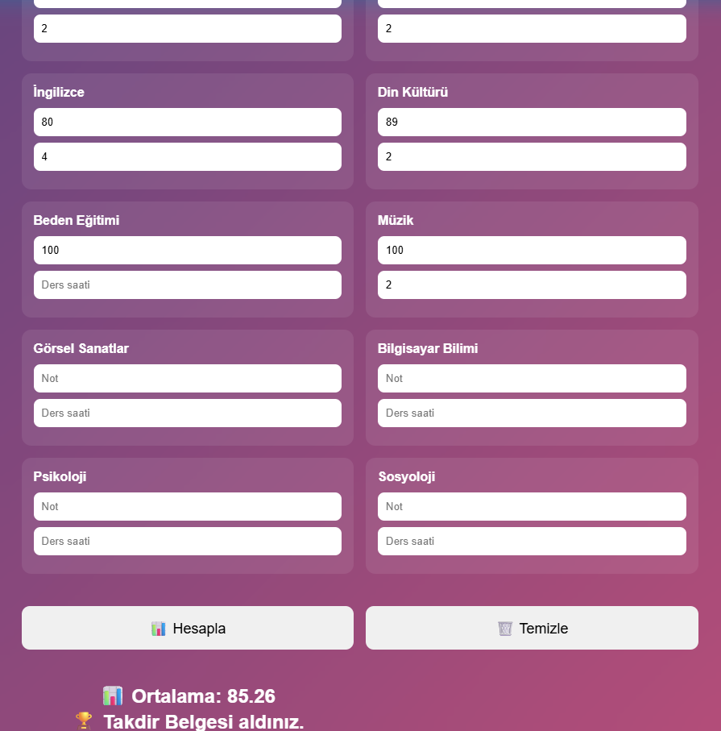
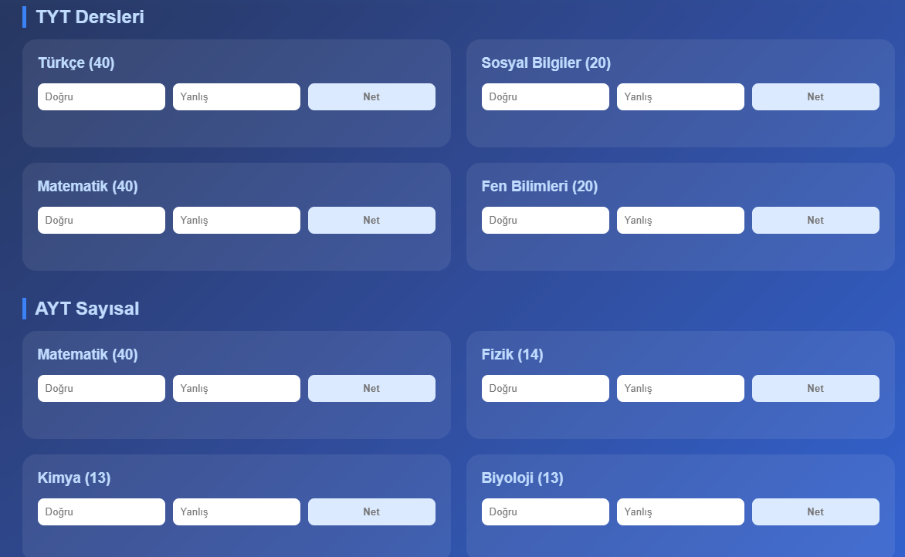
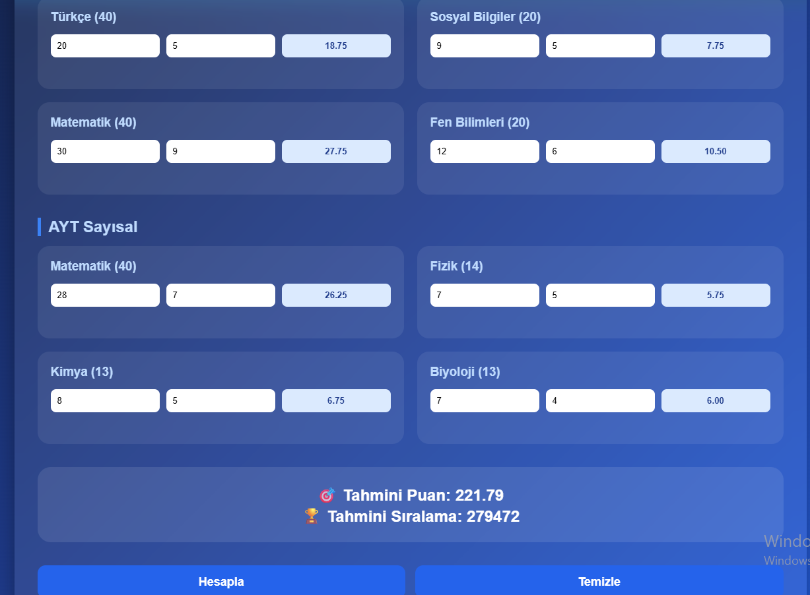

# Proje 5

5. projemde öğrencilerin işine yarayacak uygulamaları bir araya getirerek bir web sitesi geliştirdim.

Bu sitede;

- Lise öğrencileri için **Takdir-Teşekkür Belgesi Hesaplama**
- YKS öğrencileri için **Puan ve Sıralama Tahmin Sistemi**

uygulamalarını geliştirdim.

Sitemin ana sayfası aşağıdaki gibidir.

 

 

## Takdir - Teşekkür Hesaplama

Bu bölümde lise öğrencilerinin gördüğü tüm dersler bulunmaktadır.

 

 

 

Öğrenci kendi notlarını ve ders saatlerini girdikten sonra **Hesapla** butonuna bastığında ağırlıklı not ortalaması hesaplanır ve belge durumu ekranda gösterilir.

 

 

## YKS Puan ve Sıralama Tahmin Sistemi

Bu bölümde öğrencinin öncelikle puan türünü (**Sayısal, Eşit Ağırlık veya Sözel**) seçmesi gerekmektedir.

Daha sonra TYT ve AYT derslerine ait doğru ve yanlış sayılarını girerek tahmini puan ve sıralamasını hesaplayabilir.

 

 

 

Tüm bilgiler girilip **Hesapla** butonuna basıldığında öğrencinin tahmini puanı ve tahmini sıralaması ekranda görüntülenmektedir.

 

 

5. projem bu şekildedir.